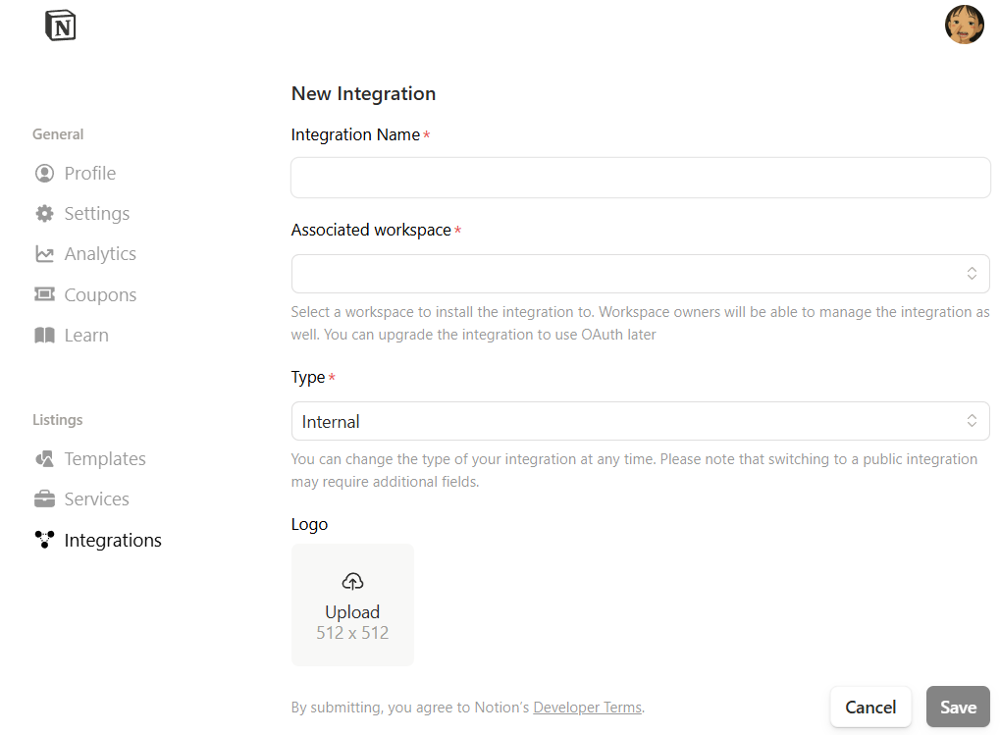

# 🛠️ Notion API 配置指南 (保姆级教程)

本工具需要通过 Notion 官方 API 将笔记推送到你的工作区。请跟随以下 3 步完成配置。这只需要一次性操作，耗时约 2 分钟。

### 核心概念说明 (必读)

为了让你的电脑能自动写笔记，我们需要创建一个“虚拟机器人助理”。
1.  **Integration (机器人)**: 你创建的虚拟助理。
2.  **Token (钥匙)**: 机器人的身份证，**千万不要发给别人**。
3.  **Connect (授权)**: 你必须把这个机器人“拉”进你的笔记页面，它才有权限写入内容。

---

## 第一步：创建机器人 (Get Token)

1.  在浏览器中打开 **[Notion My Integrations](https://www.notion.so/my-integrations)** 页面。
2.  点击页面上的 **`+ New integration`** (新建集成) 按钮。
3.  按照下图填写：
    * **Name**: 起个名字，比如 `Research Helper`。
    * **Type**: 选择 `Internal` (内部)。
    * **Logo**: (选填) 可以不填。
    * 点击 **Submit**。



4.  创建成功后，你会在 **Secrets** 栏目看到一串以 `ntn_` 或 `secret_` 开头的字符。
5.  点击 **Show** -> **Copy**。
6.  💾 **保存**: 将这串字符粘贴到你的 `config.yaml` 文件中的 `notion_token` 字段。

---

## 第二步：准备笔记本 (Create Page)

1.  打开 Notion，新建一个页面（Page），或者找一个现有的页面。
    * *建议*: 新建一个名为“**科研笔记汇总**”的空白页面，作为所有自动笔记的根目录。
2.  **获取页面 ID (Page ID)**:
    * 查看浏览器顶部的地址栏链接。
    * 链接末尾的那串 **32 位字符** 就是 Page ID。
    * *示例*: `https://www.notion.so/My-Notes-15c42a8b3e9d123123c1d2e3f4g5h6j`
    * **ID 是**: `15c42a8b3e9d123123c1d2e3f4g5h6j`
3.  💾 **保存**: 将这串字符粘贴到你的 `config.yaml` 文件中的 `root_page_id` 字段。

---

## 第三步：邀请机器人 (Authorize) 🚨 **最关键的一步**

很多用户失败都是因为忘了这一步！你必须手动把第一步创建的机器人“邀请”到第二步的页面里。

1.  停留在你的“科研笔记汇总”页面。
2.  点击页面右上角的 **`...`** (三个点) 菜单。
3.  找到 **`Connect`** (连接) 或 **`Add connections`** 选项。
4.  在搜索框里输入你第一步起的名字（例如 `Research Helper`）。
5.  点击它，并在弹窗中点击 **Confirm**。

> [这里插入一张你在 Notion 页面点击 ... -> Connect 的截图]

✅ **配置完成！**
现在，你的 `config.yaml` 应该长这样：

```yaml
notion_token: "ntn_2121255123123123123123BKInA64aMNPrn2lz91A..."
root_page_id: "15c42a8b3e9d123123c1d2e3f4g5h6j"
# 其他配置保持默认即可